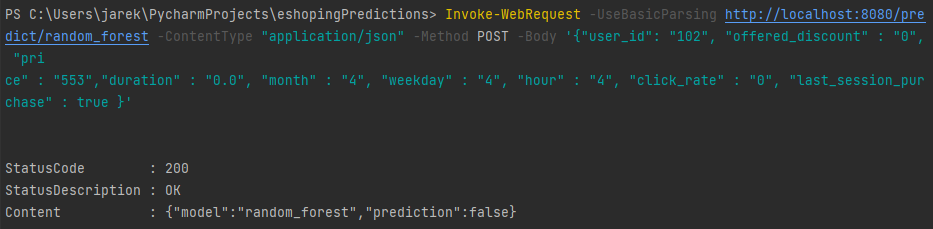

# eShoppingPredictions

Autorzy:
- Rafał Bosko
- Katarzyna Kulpa
- Jarosław Zabuski

### Opis struktury projektu:

 - data----------> folder z danymi 

 - data.raw -----> dane nieprzetworzone

 - models -------> folder z modelami

 - notebooks ----> folder z dokumentacją w postaci notatników

 - service ------> folder z mikroserwisem napisanym za pomocą Flaska i uruchamianym poprzez Dockera według poniższych instrukcji

### Serwis

#### Budowanie Dockerfile
`docker build -t e-shopping-predictions-oracool -f ./Dockerfile ./`
#### Uruchamianie poprzez terminal
`docker run -d -p 8080:80 --name eShoppingPredictions_oracool e-shopping-predictions-oracool`
#### Przetrzymywanie predykcji po zatrzymaniu serwisu
`-v path_to_local_file_db:/service/app/predictions.db` dodane do docker run
#### Zapytanie do modelu regresji logistycznej
`Invoke-WebRequest -UseBasicParsing http://localhost:8080/predict/logistic_regression -ContentType "application/json" -Method POST -Body '{"user_id": "102", "offered_discount" : "0", "price" : "553","duration" : "0.0", "month" : "4", "weekday" : "4", "hour" : "4", "click_rate" : "0", "last_session_purchase" : true }'`
#### Zapytanie do modelu lasów losowych
`Invoke-WebRequest -UseBasicParsing http://localhost:8080/predict/random_forest -ContentType "application/json" -Method POST -Body '{"user_id": "102", "offered_discount" : "0", "price" : "553","duration" : "0.0", "month" : "4", "weekday" : "4", "hour" : "4", "click_rate" : "0", "last_session_purchase" : true }'`
#### Zapytanie typu Test AB do modelu, wybranego na podstawie user_id
`Invoke-WebRequest -UseBasicParsing http://localhost:8080/predict/testAB -ContentType "application/json" -Method POST -Body '{"user_id": "102", "offered_discount" : "0", "price" : "553","duration" : "0.0", "month" : "4", "weekday" : "4", "hour" : "4", "click_rate" : "0", "last_session_purchase" : true }'`
#### Uruchomienie Sqlite3 do przejrzenia historii predykcji
`docker exec -it eShoppingPredictions_oracool sqlite3 /service/app/predictions.db`

### Przykładowe zapytanie
